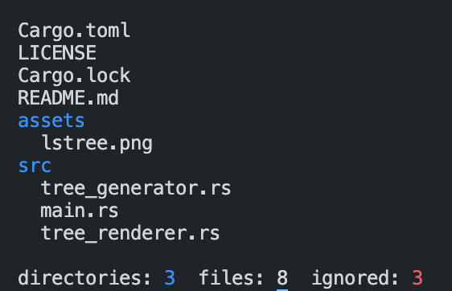

# lstree
ls and tree combined  
  

```bash
Usage: lstree [OPTIONS] [File]...

Arguments:
  [File]...  The target file(s) or directories [default: ./]

Options:
  -b, --block-size <Block size>               [default: ]
  -l, --long                                  
  -a, --all                                   
  -d, --dir-only                              
  -r, --reverse                               
  -e, --exclude <Ignore files base on regex>  [default: ]
  -t, --tree-spacer <Tree spacer>             [default: "  "]
  -h, --help                                  Print help
  -V, --version                               Print version
```
